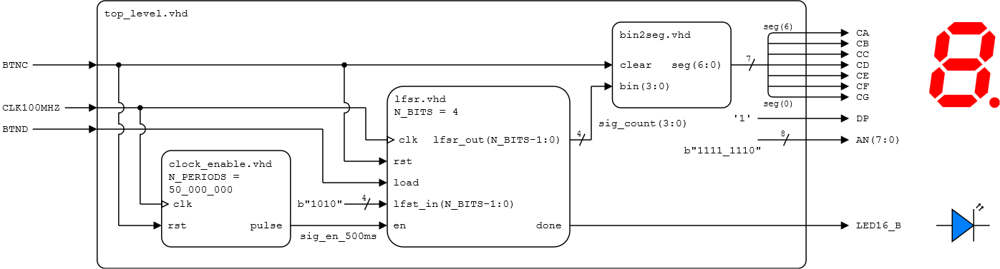

# Lab 6: LFSR counter

* [Pre-Lab preparation](#preparation)
* [Part 1: n-bit LFSR (Linear Feedback Shift Register) counter](#part1)
* [Part 2: `Generate` statement](#part2)
* [Part 3: Top level VHDL code](#part3)
* [Challenges](#challenges)
* [References](#references)

### Learning objectives

* Understand shift registers
* Understand the pseudo-random generator using LFSR (Linear Feedback Shift Register)
* Use generate statements to replicate logic in VHDL or turning on/off blocks of logic

<a name="preparation"></a>

## Pre-Lab preparation

1. Calculate the maximum length and duration of one run (one complete sequence) of the LFSR counter on the Nexys board for various `N_BITS` values of 4, 8, 16, 32, 40, and 64. Given a clock frequency of 100 MHz, determine the time it takes for the counter to complete one full sequence.

   Note that, unlike a binary counter, the full sequence of an LFSR counter contains only `2^(N_BITS)-1` values.

   | **NBIT** | **Max. length** | **Duration** |
   | :-: | :-: | :-: |
   | 4   | 15 | 150 ns |
   | 8   |  |  |
   | 16  |  |  |
   | 32  |  |  |
   | 40  |  |  |
   | 64  |  |  |

<a name="part1"></a>

## Part 1: n-bit LFSR (Linear Feedback Shift Register) counter

A binary **shift register** is a digital circuit that sequentially shifts data bits, either left or right, through a series of flip-flops controlled by a clock signal. It operates in parallel-in, serial-out (PISO) or serial-in, parallel-out (SIPO) modes. Shift registers are commonly used for serial-to-parallel and parallel-to-serial data conversion, data storage, and data transmission.

**FYI:** The structures below describe a simple 4-bit shift register in RTL (higher) and gate (lower) levels.

**RTL level:**


**Gate level:**


A **Linear Feedback Shift Register (LFSR)** is a shift register whose input bit is a linear function of its previous state using XOR or XNOR gates. The feedback taps determine the new bit entering the register. LFSRs are widely used for generating pseudo-random sequences in digital systems, cryptography, and communication protocols due to their simplicity, efficiency, and long periods before repeating sequences. They are also used for channel encoding and decoding, error detection, and testing digital systems.

**Gate level:**


1. Run Vivado, create a new project and implement a 4-bit LFSR counter with clock enable and load signals:

   1. Project name: `lfsr`
   2. Project location: your working folder, such as `Documents`
   3. Project type: **RTL Project**
   4. Create a VHDL source file: `lfsr`
   5. Do not add any constraints now
   6. Choose a default board: `Nexys A7-50T`
   7. Click **Finish** to create the project
   8. Define I/O ports of new module:

      | **Port name** | **Direction** | **Type** | **Description** |
      | :-: | :-: | :-- | :-- |
      | `clk`  | input  | `std_logic` | Main clock |
      | `rst`  | input  | `std_logic` | High-active synchronous reset |
      | `load` | input  | `std_logic` | Enable signal to load default/seed data |
      | `lfsr_in` | input  | `std_logic_vector(3 downto 0)` | Default/seed data |
      | `en`   | input  | `std_logic` | Clock enable input |
      | `done` | output  | `std_logic` | Sequence completed |
      | `lfsr_out` | output | `std_logic_vector(3 downto 0)` | Register value |

2. Extend the code and use generic `N_BITS` to define number of bits for the counter.

   ```vhdl
   -- Design source file
   entity lfsr is
       generic (
           N_BITS : integer := 4 --! Default number of bits
       );
       port (
           ...
           lfsr_out : out std_logic_vector(N_BITS-1 downto 0)
       );
   end entity lfsr;
   ```

3. Use VHDL templates in menu **Tools > Language Templates**, search for `lfsr`, copy/paste `4-Bit w/ CE and Sync Active High Reset` template to the architecture and modify the code according to your I/O port names.

   > **Note:** The LFSR is located in:
   > ```bash
   > Language Templates:
   > VHDL
   >   Synthesis Constructs
   >     Coding Examples
   >       Counters
   >         LFSR
   >           4-Bit w/ CE and Sync Active High Reset
   > ```

   ```vhdl
   architecture Behavioral of lfsr is
       -- Define a temporary signal that is of type std_logic_vector(<width>-1 downto 0).
       -- Where width is the number of bits to shift.

   begin
       process(<clock>)
       begin
           if (<clock>'event and <clock> ='1') then
               if (<reset> = '1') then
                   <reg_name> <= (others => '0');
   
               -- else if load = 1 then load default counter value lfsr_in
   
               elsif <clock_enable>='1' then
                   <reg_name>(N_BITS-1 downto 1) <= <reg_name>(N_BITS-2 downto 0) ;
                   <reg_name>(0) <= not(<reg_name>(3) XOR <reg_name>(2));  -- !!! TEMPLATE IS WRONG !!!
               end if;
           end if;
       end process;

       -- Assign internal register to output
       <output> <= <reg_name>;

       -- Create a `done` pulse when sig_reg = lfsr_in

   end Behavioral;
   ```

   **TODOs:**
      * Define an internal signal `sig_reg` of data type `std_logic_vector(N_BITS-1 downto 0)` to implement the shift register.
      * Use `rising_edge(clk)` instead of `clk='1' and clk'event` to test clock edge.
      * Assign the whole internal register to the output `lfsr_out <= sig_reg;`.
      * Assign the `done` pulse.

   To implement a linear feedback for an LFSR counter in VHDL, an XNOR gate is integrated with a 4-bit shift register. Use the feedback taps `sig_reg(3)` and `sig_reg(2)`, and connect it to the least significant bit (LSB) of the internal register.

4. Use **Flow > Open Elaborated design** and see the schematic after RTL analysis.

5. Generate a [simulation source](https://vhdl.lapinoo.net/testbench/) named `lfsr_tb`. In **testbench**, define a constant `C_NBITS`, prior to declaring the component and use it to declare your internal counter signal:

   ```vhdl
   -- Testbench file
   ...
   component lfsr is
       generic (
           N_BITS : integer
       );
   ...

   constant C_NBITS : integer := 4; --! Simulating number of bits
   signal lfsr_out : std_logic_vector(C_NBITS-1 downto 0);
   ...
   ```

   When you instantiate your counter, you then also bind the `N_BITS` generic to this constant:

   ```vhdl
   dut : component lfsr
       generic map (
           N_BITS => C_NBITS
       )
       ...
   ```

   Test the 4-bit counter and validate the functionality of enable and seed values. Experiment with various tap configurations for XNOR gates and analyze the length of the generated pseudo-random sequence.

   | **Taps** | **Length** | **Values** |
   | :-: | :-: | :-- |
   | 3, 2 | 15 | 0, 1, 3, 7, 14, 13, 11, 6, 12, 9, 2, 5, 10, 4, 8 |
   | 3, 1 |  |  |
   | 3, 0 |  |  |
   | 2, 1 |  |  |
   | 2, 0 |  |  |
   | 1, 0 |  |  |

<a name="part2"></a>

## Part 2: `Generate` statement

In VHDL, there is a way for iteratively or conditionally elaborating a part of a description. Typically, it is used to define a group of identical components using a single component specification and then repeating it using the `generate` mechanism.

```vhdl
-- Iterative
label : for parameter in range generate
    { concurrent_statements }
end generate label;

-- Conditional
label : if condition generate
    { concurrent_statements }
end generate label;
```

1. Add an internal signal `sig_feedback` and define the XNOR gate outside the process.

   ```vhdl
       ...
   architecture Behavioral of lfsr is
       -- Define an internal feedback with xnor gate(s)
       signal sig_feedback : std_logic;
   begin
       process (clk)
       begin
           ...
           <reg_name>(0) <= sig_feedback;
           ...
       end process;

       -- Create feedback for 4-bit LFSR counter
       sig_feedback <= sig_reg(3) xnor sig_reg(2);
   end Behavioral;
   ```

2. Use conditional `generate` statements and define `sig_feedback` for several `N_BITS` values. See [AMD LFSR Counters](https://docs.xilinx.com/v/u/en-US/xapp052) to get the taps for maximum-length LFSR counters. Note that, the taps here are indexed from 1 and not from 0, ie. 4-bit counter use taps 4 and 3.

   ```vhdl
   G_4BIT : if N_BITS = 4 generate
       -- Create feedback for 4-bit LFSR counter
       sig_feedback <= sig_reg(3) xnor sig_reg(2);
   end generate G_4BIT;
   ```

3. Simulate your design and try several `C_NBITS` values.

<a name="part3"></a>

## Part 3: Top level VHDL code

1. Create a VHDL design source named `top_level` and implement: an n-bit LFSR counter and LEDs on the Nexys A7 board (Version 1) or a 4-bit LFSR counter and 7-segment display (Version 2).

   * **Version 1:**

   

   * **Version 2:**

   

   **Note:** The `enable_clock` and `bin2seg` components from the previous lab(s) are required. Do not forget to **copy files** you need to `YOUR-PROJECT-FOLDER/lfsr.srcs/sources_1/new/` folder and **add them to the project**.

   ```vhdl
   architecture behavioral of top_level is
       -- Component declaration: clock enable


       -- Component declaration: LFSR counter


       -- Component declaration: bin2seg


       -- Local signals for counter


   begin

       -- Component instantiation: clock enable


       -- Component instantiation: LFSR counter


       -- Component instantiation: bin2seg


       -- Turn off decimal point


       -- Set display position


   end architecture behavioral;
   ```

2. Create a new [constraints XDC](https://raw.githubusercontent.com/Digilent/digilent-xdc/master/Nexys-A7-50T-Master.xdc) file `nexys-a7-50t`, uncomment the used pins according to your `top_level` entity.

3. Compile the project (ie. transform the high-level VHDL code into a binary configuration file) and download the generated bitstream `YOUR-PROJECT-FOLDER/lfsr.runs/impl_1/top_level.bit` into the FPGA chip.

<a name="challenges"></a>

## Challenges

1. Modify the output pulse signal from the clock enable component based on a control signal (like a switch). You will be able to enable or disable the pulse signal itself, to achieve the LFSR pause/resume functionality.

2. Implement an 8-bit LFSR counter and display its value on two 7-segment displays. Split the 8-bit LFSR value into two 4-bit nibbles, each corresponding to a digit for the 7-segment displays. Use a 1-bit simple counter (from the last lab) to alternate between the two displays at a suitable timing interval, creating the illusion that both digits are shown simultaneously. Ensure that each 4-bit value is properly encoded to display the corresponding digit on the 7-segment displays.

<a name="references"></a>

## References

1. NandLand. [Concatenation Operator – VHDL Example](https://nandland.com/concatenation-operator/)

2. NandLand. [LFSR in an FPGA – VHDL & Verilog Code](https://nandland.com/lfsr-linear-feedback-shift-register/)

3. AMD. [Efficient Shift Registers, LFSR Counters, and Long Pseudo-Random Sequence Generators (XAPP052)](https://docs.xilinx.com/v/u/en-US/xapp052)

4. Digilent. [General .xdc file for the Nexys A7-50T](https://github.com/Digilent/digilent-xdc/blob/master/Nexys-A7-50T-Master.xdc)
