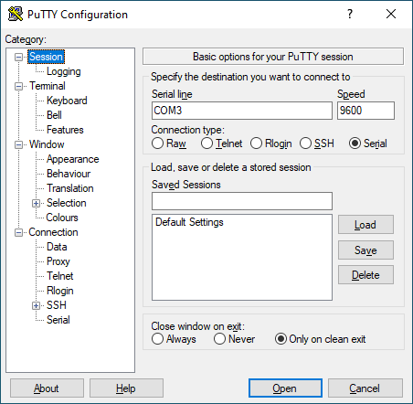

# Lab 8: UART Transmitter

* [Pre-Lab preparation](#preparation)
* [Part 1: Finite State Machine (FSM)](#part1)
* [Part 2: Basics of UART communication](#part2)
* [Part 3: UART Transmitter in VHDL](#part3)
* [Part 4: Top level VHDL code](#part4)
* [Challenges](#challenges)
* [References](#references)

### Learning objectives

* Understand the philosophy and use of finite state machines
* Use state diagrams
* Understand the difference between Mealy and Moore type of FSM in VHDL
* Understand the UART interface
* Use edge detectors

<a name="preparation"></a>

## Pre-Lab preparation

1. Calculate how many clock periods with frequency of 100&nbsp;MHz contain bit periods representing serial communication with specific baudrates.

   &nbsp;
   
   &nbsp;

<!--
https://editor.codecogs.com/
N\text{\_}PERIODS=\frac{1}{baudrate}\cdot f_{clk}=
-->

   | **Baudrate** | **Number of clk periods** | **Common usage** |
   | :-: | :-: | :-- |
   | 2400 |  | Low-speed serial devices |
   | **9600** | 10_417 | Default for many microcontrollers |
   | 57600 |  | Mid-speed serial communications |
   | **115200** |  | High-speed UART, default for many modern devices |

2. Optional: See video tutorial [Implementing the candy-lock FSM in VHDL](https://www.youtube.com/watch?v=5kC1XEWhIFQ)

<a name="part1"></a>

## Part 1: Finite State Machine (FSM)

A **Finite State Machine (FSM)** is a mathematical model used to describe and represent the behavior of systems that can be in a finite number of states at any given time. It consists of a set of states, transitions between these states, and actions associated with these transitions.

The main properties of using FSMs include:

   1. **Determinism**: FSMs are deterministic if, for each state and input, there is exactly one transition to a next state. This property simplifies analysis and implementation.

   2. **State Memory**: FSMs inherently have memory as they retain information about their current state. This allows them to model systems with sequential behavior.

   3. **Simplicity**: FSMs are relatively simple and intuitive to understand, making them useful for modeling and designing systems with discrete and sequential behavior.

   4. **Parallelism**: FSMs can represent parallelism by having multiple state machines working concurrently, each handling different aspects of the system.

The main types of FSMs include Moore Machine and Mealy Machine. In a **Moore machine**, outputs are associated with states (see [figure](https://www.allaboutcircuits.com/technical-articles/implementing-a-finite-state-machine-in-vhdl/) bellow), while in a **Mealy machine**, outputs are associated with transitions between states. This means that Moore machines produce outputs only after transitioning to a new state, while Mealy machines can produce outputs immediately upon receiving an input.

   

One widely used method to illustrate a finite state machine is through a **state diagram**, comprising circles connected by directed arcs. Each circle denotes a machine state labeled with its name, and, in the case of a Moore machine, an [output value](https://ocw.mit.edu/courses/electrical-engineering-and-computer-science/6-004-computation-structures-spring-2017/c6/c6s1/) associated with the state.

   

Directed arcs signify the transitions between states in a finite state machine (FSM). For a Mealy machine, these arcs are labeled with input/output pairs, while for a Moore machine, they are labeled solely with inputs.

   

<a name="part2"></a>

## Part 2: Basics of UART communication

The UART (Universal Asynchronous Receiver-Transmitter) is not a communication protocol like SPI and I2C, but a physical circuit in a microcontroller, or a stand-alone integrated circuit, that translates communicated data between serial and parallel forms. It is one of the simplest and easiest method for implement and understanding.

In UART communication, two UARTs communicate directly with each other. The transmitting UART converts parallel data from a CPU into serial form, transmits it in serial to the receiving UART, which then converts the serial data back into parallel data for the receiving device. Only two wires are needed to transmit data between two UARTs. Data flows from the Tx pin of the transmitting UART to the Rx pin of the receiving UART: [link](https://www.circuitbasics.com/basics-uart-communication/), [link](https://www.analog.com/en/analog-dialogue/articles/uart-a-hardware-communication-protocol.html).

UARTs transmit data asynchronously, which means there is no external clock signal to synchronize the output of bits from the transmitting UART. Instead, timing is agreed upon in advance between both units, and special **Start** (log. 0) and 1 or 2 **Stop** (log. 1) bits are added to each data package. These bits define the beginning and end of the data packet so the receiving UART knows when to start reading the bits. In addition to the start and stop bits, the packet/frame also contains data bits and optional parity.

The amount of **data** in each packet can be set from 5 to 9 bits. If it is not otherwise stated, data is transferred least-significant bit (LSB) first.

**Parity** is a form of very simple, low-level error checking and can be Even or Odd. To produce the parity bit, add all 5-9 data bits and extend them to an even or odd number. For example, assuming parity is set to even and was added to a data byte `0110_1010`, which has an even number of 1's (4), the parity bit would be set to 0. Conversely, if the parity mode was set to odd, the parity bit would be 1.

One of the most common UART formats is called **9600 8N1**, which means 8 data bits, no parity, 1 stop bit and a symbol rate of 9600&nbsp;Bd.


<a name="part3"></a>

## Part 3: UART Transmitter in VHDL

1. Run Vivado, create a new project and implement an FSM version of UART transmitter 8N1 with clock enable and reset:

   1. Project name: `uart`
   2. Project location: your working folder, such as `Documents`
   3. Project type: **RTL Project**
   4. Create a VHDL source file: `uart_tx`
   5. Do not add any constraints now
   6. Choose a default board: `Nexys A7-50T`
   7. Click **Finish** to create the project
   8. Define I/O ports of new module:

      | **Port name** | **Direction** | **Type** | **Description** |
      | :-: | :-: | :-- | :-- |
      | `clk`      | input  | `std_logic` | Main clock |
      | `rst`      | input  | `std_logic` | High-active synchronous reset |
      | `baud_en`  | input  | `std_logic` | Clock Enable signal (Baud tick) |
      | `tx_start` | input  | `std_logic` | Start transmission |
      | `data_in`  | input  | `std_logic_vector(7 downto 0)` | Data to transmit |
      | `tx` | output | `std_logic` | UART Tx line |
      | `tx_done` | output | `std_logic` | Transmission completed |

2. Define four states for the FSM and an internal counter in the architecture declaration section to count a sequence of data bits.

    ```vhdl
    architecture behavioral of uart_tx is
        -- FSM States
        type   state_type is (IDLE, START, DATA, STOP);
        signal state : state_type;

        -- Transmission Registers
        signal sig_count : integer range 0 to 7;
        signal sig_reg   : std_logic_vector(7 downto 0);
    begin
        ...
    ```

3. Complete the architecture body section according to the following template.

    ```vhdl
    begin

        -- UART Transmitter FSM
        p_uart_tx : process (clk) is
        begin

            if rising_edge(clk) then
                if (rst = '1') then
                    -- Reset state to IDLE, set Tx to 1

                    -- Reset sig_count to 0 and tx_done to 0

                elsif (state = IDLE and tx_start = '1') then
                    state <= START;

                elsif (baud_en = '1') then  -- Use clock enable signal

                    case state is

                        when START =>
                            tx        <= '0';      -- Start bit (LOW)
                            sig_reg   <= data_in;  -- Load data
                            sig_count <= 0;
                            tx_done   <= '0';
                            state     <= DATA;

                        when DATA =>
                            tx      <=  -- Transmit LSB first
                            sig_reg <=  -- Shift register to right
                            if (sig_count = 7) then
                                state <= STOP;
                            else
                                sig_count <= sig_count + 1;
                            end if;

                        when STOP =>
                            -- Set Tx stop bit (HIGH)

                            -- Set tx_done to 1

                            -- Set next state to IDLE

                        when IDLE =>
                            -- Keep Tx line to high

                            -- Clear tx_done to 0

                        when others =>
                            state <= IDLE;

                    end case;

                end if;
            end if;

        end process p_uart_tx;

    end architecture behavioral;
    ```

4. Use **Flow > Open Elaborated design** and see the schematic after RTL analysis.

5. Generate a [simulation source](https://vhdl.lapinoo.net/testbench/) named `uart_tx_tb`, execute the simulation, and validate the functionality.

   > **Note:** To display internal signal values, follow these steps:
   > 1. Select `dut` in the **Scope** folder.
   > 2. Right-click on the `state` signal name in the **Objects** folder.
   > 3. Add this signal by selecting the **Add to Wave Window** command.
   > 4. Click on the **Relaunch Simulation** icon.
   >
   >    

<a name="part4"></a>

## Part 4: Top level VHDL code

1. Create a VHDL design source named `top_level`. Implement a button-triggered UART transmitter on the Nexys A7 board to send data to your computer via the serial line. The transmitted data will be specified using the 8 switches `SW[7:0]` to input ASCII codes, which you can look up on this [ASCII code chart](https://www.ascii-code.com/).

   

   > **Notes:**
   > * The `clock_enable` component from the previous lab(s) is required. Do not forget to copy both files to `YOUR-PROJECT-FOLDER/uart.srcs/sources_1/new/` folder and add them to the project or use **Copy scripts to project** checkbox while adding design source files in Vivado.
   > * Your transmitter signal `tx` must be connected to onboard FTDI FT2232HQ USB-UART bridge receiver, ie. use pin number `D4` which is maped in XDC template to `UART_RXD_OUT` (see [Nexys A7 reference manual, section 6](https://digilent.com/reference/programmable-logic/nexys-a7/reference-manual?redirect=1)).
   
2. Use online template for your [constraints XDC](https://raw.githubusercontent.com/Digilent/digilent-xdc/master/Nexys-A7-50T-Master.xdc) file `nexys-a7-50t` and uncomment the used pins according to the top_level entity.

3. Run Putty or any other serial monitor application. Set the **Connection type** to `Serial`, specify your **Serial line** (e.g., COM3), set the **Speed** (or Baud Rate), and then click the **Open** button to initiate the communication.

   
   

<a name="challenges"></a>

## Challenges

A positive **edge detector** generates a single clock pulse when the input signal transitions from low to high (rising edge). In contrast, a negative edge detector generates a pulse when the input signal transitions from high to low (falling edge). The VHDL code detects these transitions by comparing the current state of the signal with its previous state using `and` and `not` gates. Based on the comparison, the code outputs a single clock pulse whenever the appropriate transition occurs.


<!--
https://wavedrom.com/

{
  signal: [
    {name: "clk",         wave: 'P.................'},
    {name: "btn",         wave: 'l...h.......l.....'},
    {name: "sig_delayed", wave: 'l....h.......l....'},
    {},
    {name: "pos_edge",    wave: 'l...hl............'},
    {name: "neg_edge",    wave: 'l...........hl....'},
  ],
}
-->

1. Create a new source file that includes the I/O ports as shown in the figure above. Implement an `edge_detector` component in this file. Then, use the `edge_detector` component in your `top_level` design to trigger the UART transmission.

    ```vhdl
    ...

    architecture behavioral of edge_detector is
        signal sig_delayed : std_logic;

    begin
        -- Remember the previous value of a signal and generates single
        -- clock pulses for positive and negative edges of the signal.
        p_edge_detector : process (clk) is
        begin
            if rising_edge(clk) then
                sig_delayed <= btn;
            end if;
        end process p_edge_detector;

        -- Assign output signals for edge detector
        pos_edge <=
        neg_edge <=

    end architecture behavioral;
    ```

   

   > **Note:** Use reserved keyword `open` when you instantiate a module that has an output that is not needed.

<a name="references"></a>

## References

1. David Williams. [Implementing a Finite State Machine in VHDL](https://www.allaboutcircuits.com/technical-articles/implementing-a-finite-state-machine-in-vhdl/)

2. MIT OpenCourseWare. [L06: Finite State Machines](https://ocw.mit.edu/courses/electrical-engineering-and-computer-science/6-004-computation-structures-spring-2017/c6/c6s1/)

3. VHDLwhiz. [One-process vs two-process vs three-process state machine](https://vhdlwhiz.com/n-process-state-machine/)
